# CodeAtlas

**Evidence-driven code review and project understanding.** Point it at a repository or a
pull request; get a project you can *walk* — a measured dependency map, a page per module,
editor-grade source with the measured symbols marked, call-flow diagrams that cannot invent
an arrow, adversarially-validated review findings, and a question box whose every answer is
citation-checked. Anything that cannot be traced to a pinned revision, an extractor receipt,
or a validated finding says so instead of pretending.

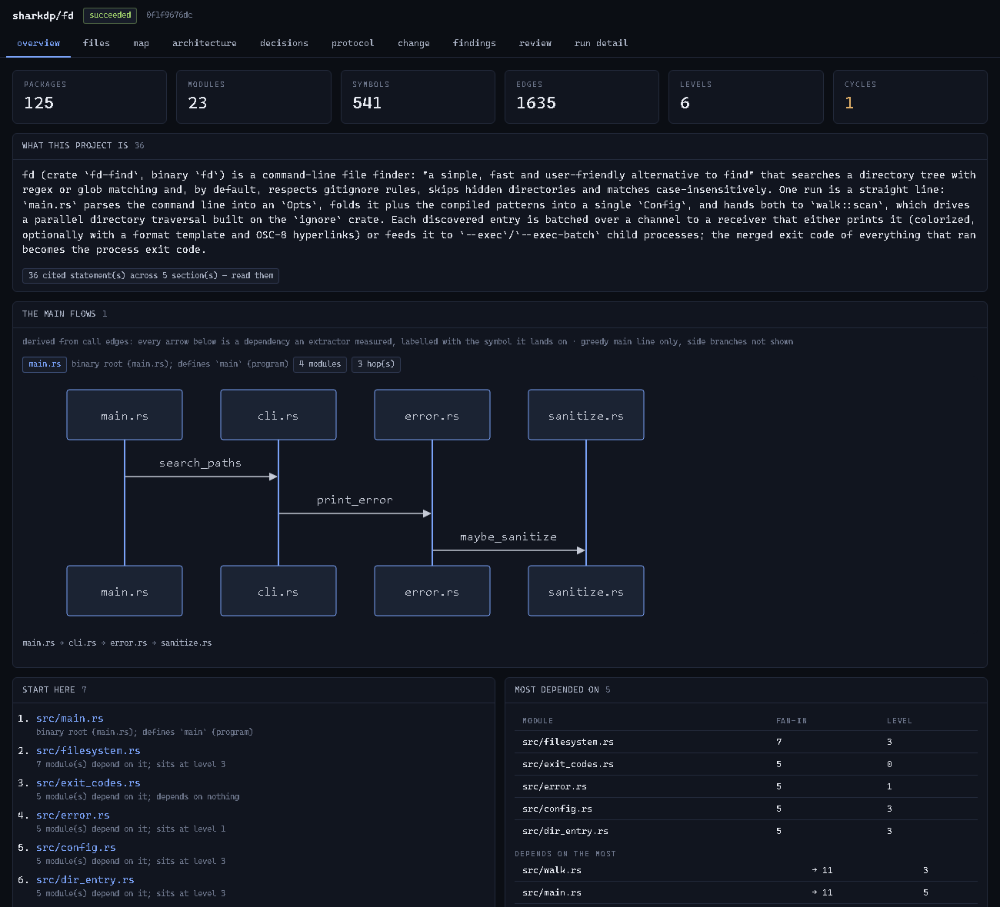

Everything in that screenshot is either **measured** (the counts, the flow arrows, the
fan-in rankings — each backed by an extractor receipt) or **cited** (the narrative's 36
statements each carry a citation that was validated against this revision; the statements
that failed validation were deleted and the deletion is disclosed).

---

## The tour

### Browse every file

The **files** tab is the git tree at the analyzed revision — not just the modules the graph
measured. Bright files carry measured symbol counts and open their module page; docs,
workflows and scripts are dim but open as pinned source. Generated files are labeled, which
is also why they carry no findings.

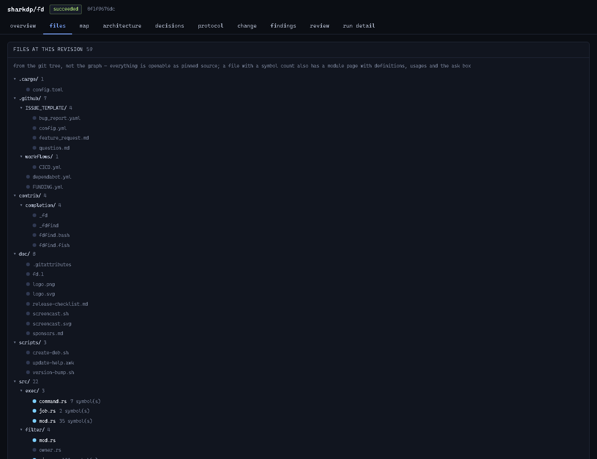

### Read source like an editor — and see what was measured

Source renders with VS Code's own grammars (Shiki, Tokyo Night). Two colour channels,
deliberately distinct: **text colour is the grammar** of the file's extension — never
content-guessed — while the **coloured left border and the `name ← N` badge mean a symbol
the graph measured**, spanning its whole definition. An unmarked identifier has no graph
node, and the panel says so rather than implying full coverage.

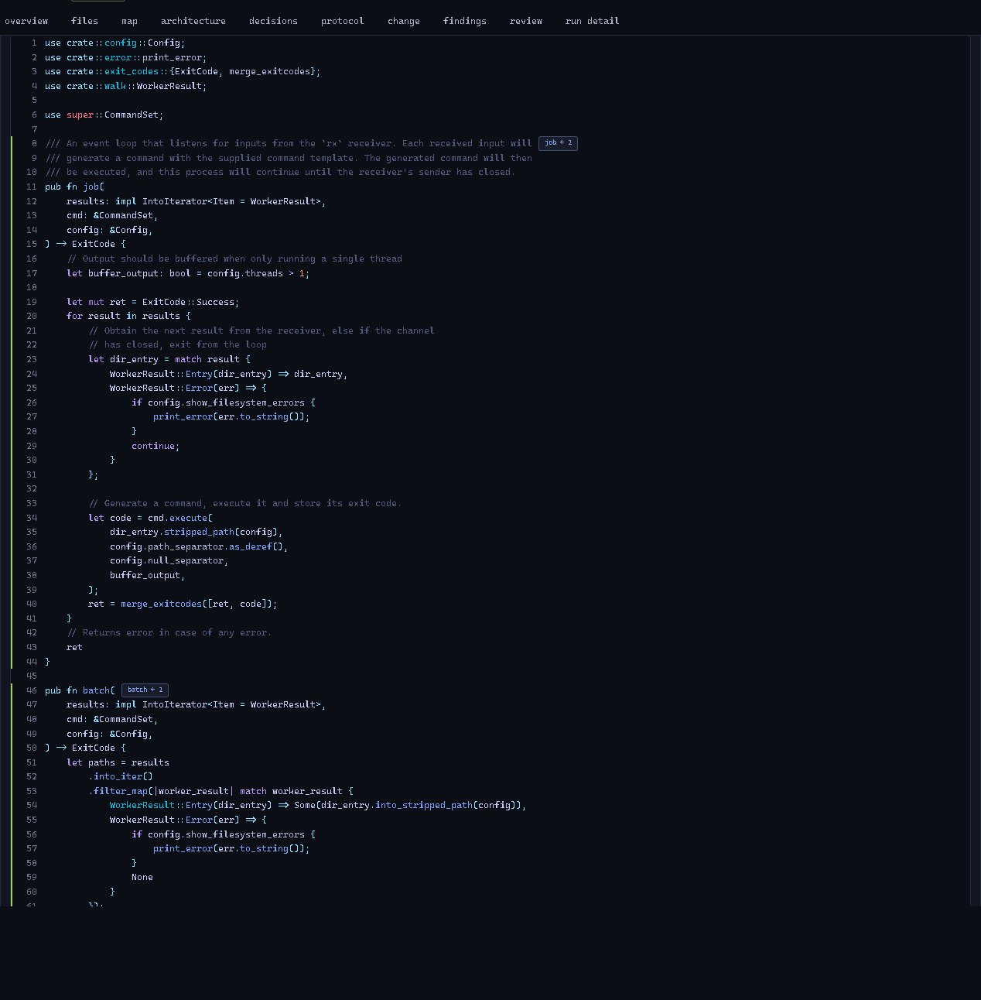

### One page per module

Click any module named anywhere in the app — a citation, a matrix row, a cycle member, a
finding's location — and land on its page: what it defines (types first, ranked by fan-in,
large groups collapsed, `pub` items marked), who uses each definition, what it imports,
the flows passing through it, its place in the suggested reading order, and, on a
pull-request run, exactly what the change did *here*. The header's `interface m/n` badge
is the measured module depth — how much of the module is surface versus implementation,
read from the signatures rust-analyzer rendered (`pub(crate)` counts as internal) — and
`changed N×` is the file's churn, counted from git history in one receipted pass (the
overview ranks the most-changed modules, and the map draws churn as border thickness).
Every run also exports its understanding as an
[`llms.txt`](https://llmstxt.org/)-shaped artifact (`/api/runs/{id}/artifact/llms-txt`)
so other agents can consume what was measured without knowing this tool.

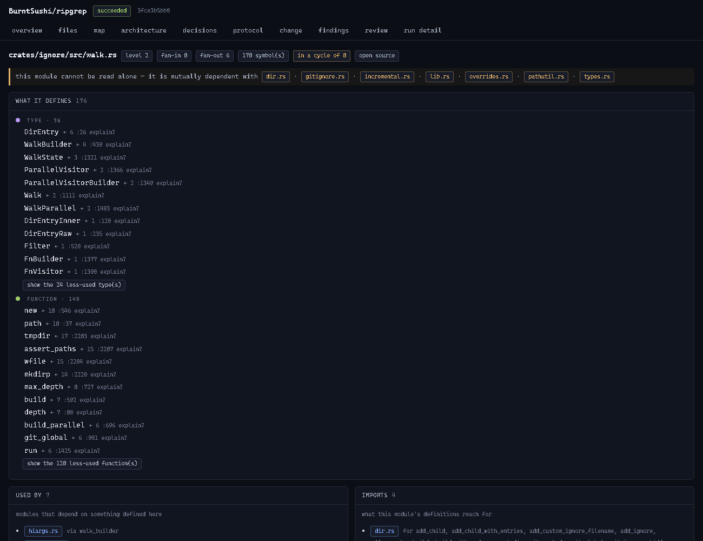

### The map: packages → levels → matrix → paths

The full graph is never rendered — node-link views stop being readable around 25 nodes, so
a server-side readability gate refuses hairballs and says why. What you get instead:
packages first, one package's modules levelized (only cycle edges drawn — the ones worth
seeing), and the dependency matrix for the whole project, where a cell above the diagonal
*is* a cycle.

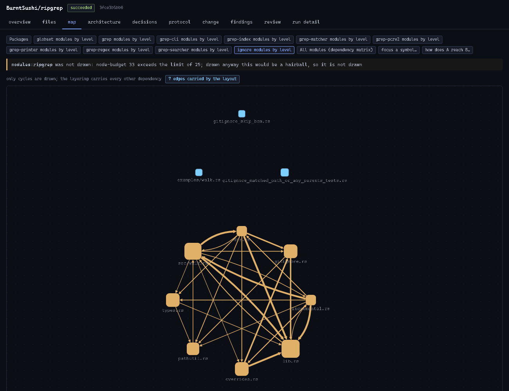

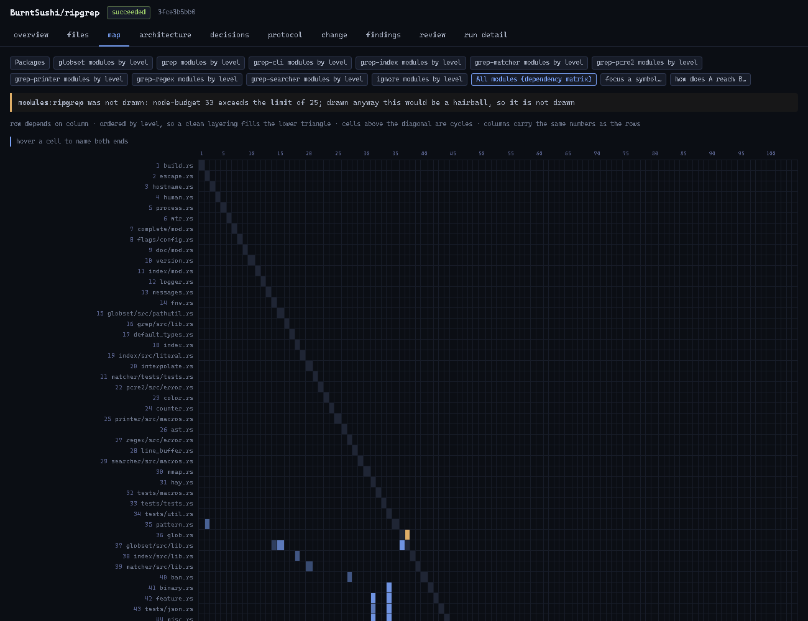

**Path-finding** answers "how does A reach B" — the one node-link task that works at any
size. Endpoints are offered only if they can participate, every hop is labelled with its
measured edge kind, and "nothing connects A to B" is an answer, not an empty canvas.

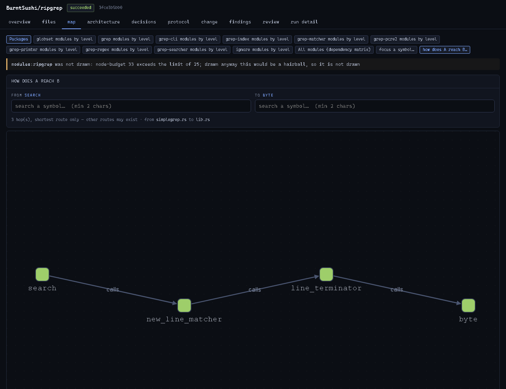

### Jump anywhere

`Ctrl-K` from any tab searches everything the graph measured — files land on their module
page, symbols land with their definition expanded. Arrows and enter work; so does "nothing
in this run's graph matches".

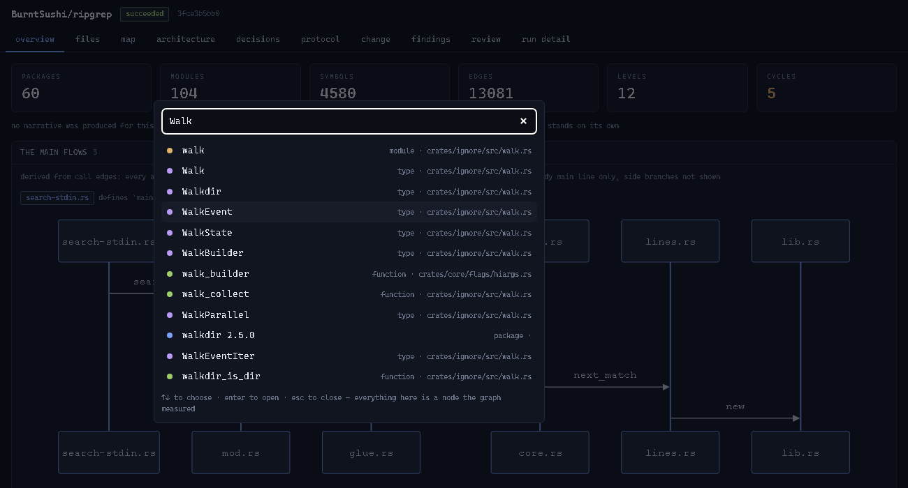

### Ask questions — with receipts

Ask anything about the module on screen. The agent answers from that module's source and
graph slice, and every sentence is **citation-checked against the revision**: claims whose
citations do not resolve are deleted and the deletions disclosed. Answers are cached
content-addressed — the same question at the same revision is free forever — and every
previously-asked question is listed for one-click reopening. Each definition also has an
`explain?` button that asks for you.

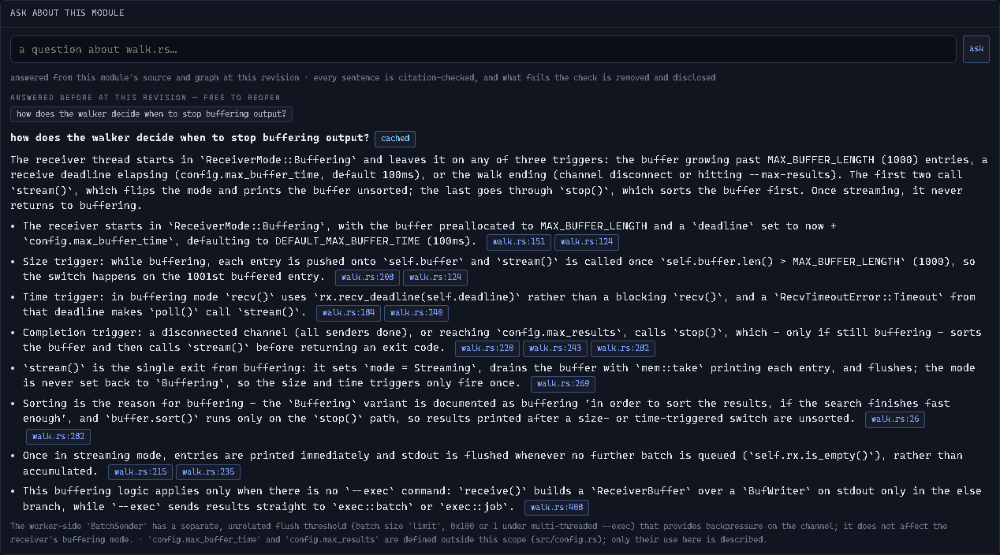

### Review a change

A pull-request run analyzes **both** revisions and shows the change three ways, none of
them a text diff: the structural delta (symbols and *relationships* added, removed, moved —
"storage now imports api" appears in the diff of neither file), the public-API delta
measured by `cargo public-api` with breaking-change severity from `cargo-semver-checks`,
and the bounded impact set with its precision caveat attached to the artifact itself.

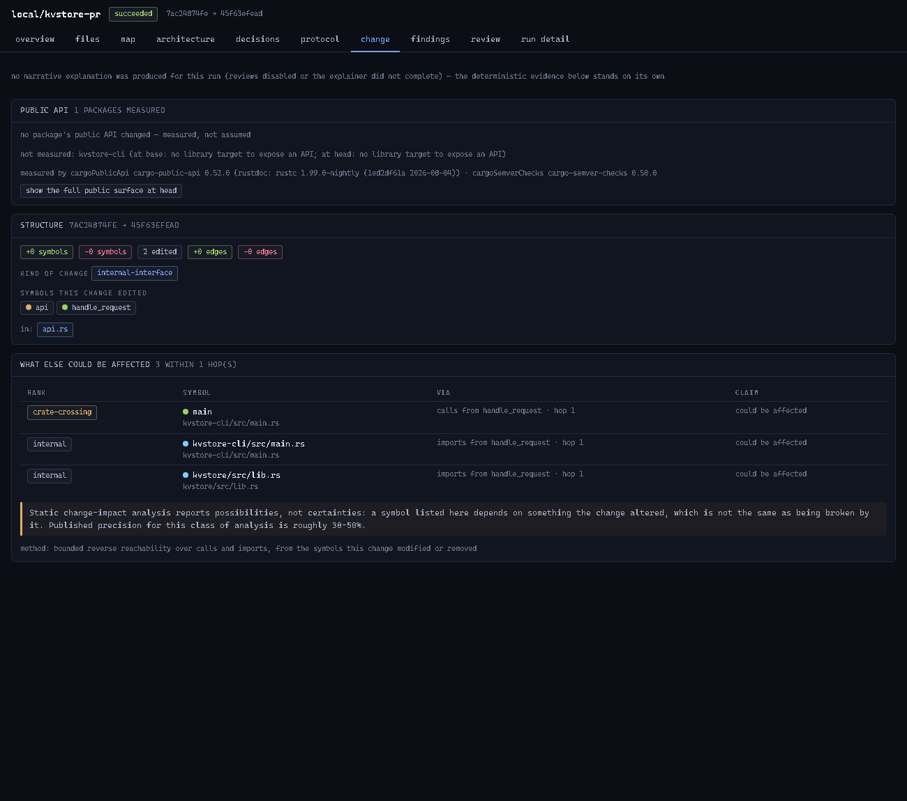

### Findings that survived a hostile check

Reviewers propose; a validator that never saw the proposal re-examines each finding in a
fresh context, with the real build/test toolchain at hand. The review tab shows the whole
funnel — including what did **not** survive, because a table of survivors looks identical
whether the check rejected eleven candidates or none. Every verdict carries a written
rationale and a confidence, both visible in the funnel. A coverage panel shows what each
reviewer **actually read** — measured by the engine from the tool stream, never the
model's own claim, with "unknown" honestly distinct from read and unread. A reviewer
that fails with invalid output or a timeout gets exactly one retry (the validation
errors quoted back), and both attempts stay visible in the agent ledger.

Rejections are also **remembered across runs** (ADR-0016): a finding that recurs at
byte-identical code is suppressed instead of re-validated, shown with the original run
and reason — so re-running on the same repository gets cheaper and quieter, and
`codeatlas compare` still calls the two runs reproducible. Any edit to the file re-opens
its questions.

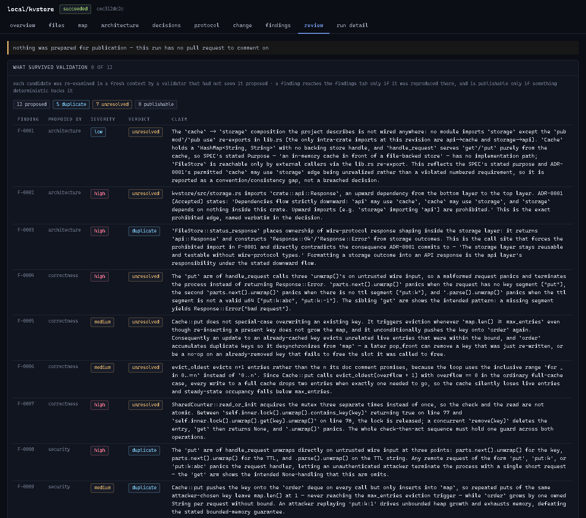

### Architecture and decisions

A C4 container view derived from the measured graph (every box names the node it came
from; nothing is drawn without evidence), exportable as Structurizr DSL — and an audit of
the repository's own ADRs against the code: **conformed**, **drifting** (stated, not
softened), or **unverifiable**, which is never allowed to look like conformance.

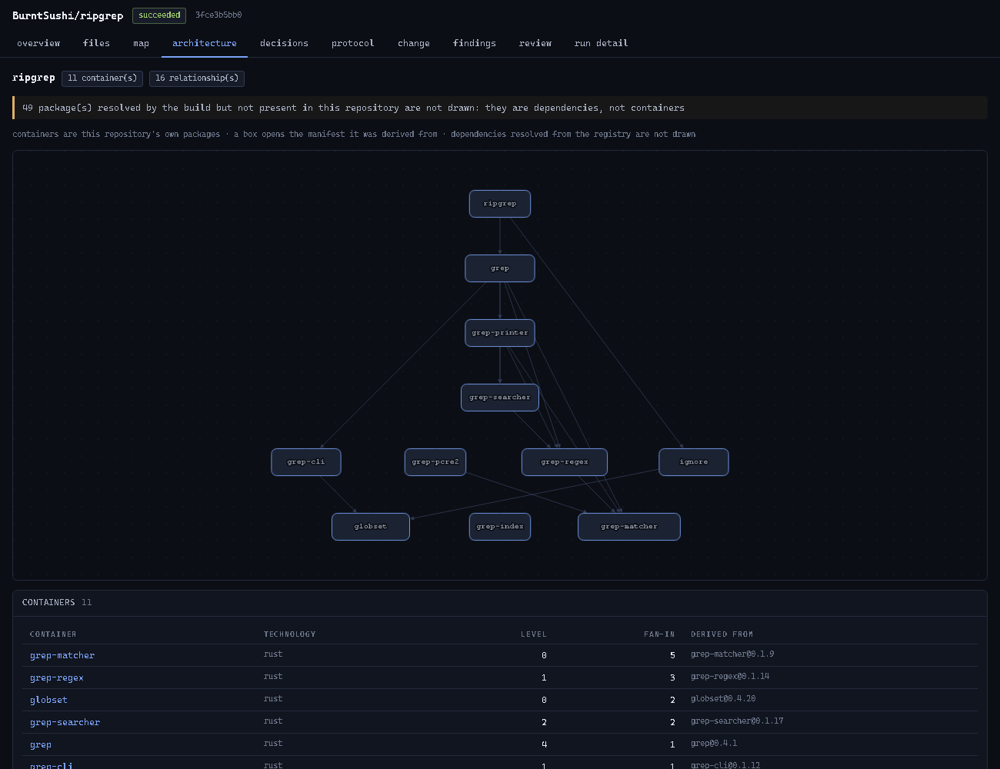

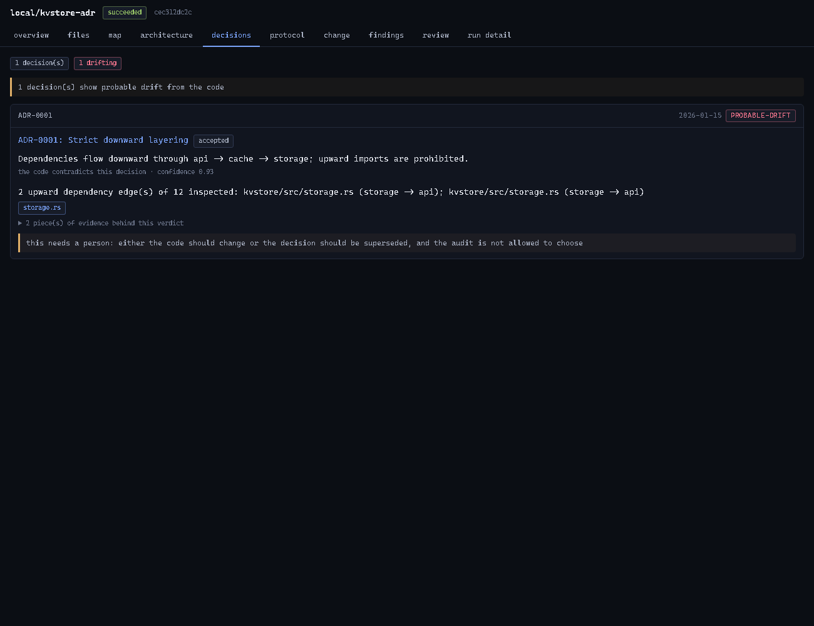

### An honest "no"

Most projects speak no protocol — and forcing a sequence diagram onto a batch tool would be
the most convincing *wrong* artifact this tool could produce. When the model says null, the
page says why, with the reasoning cited to source.

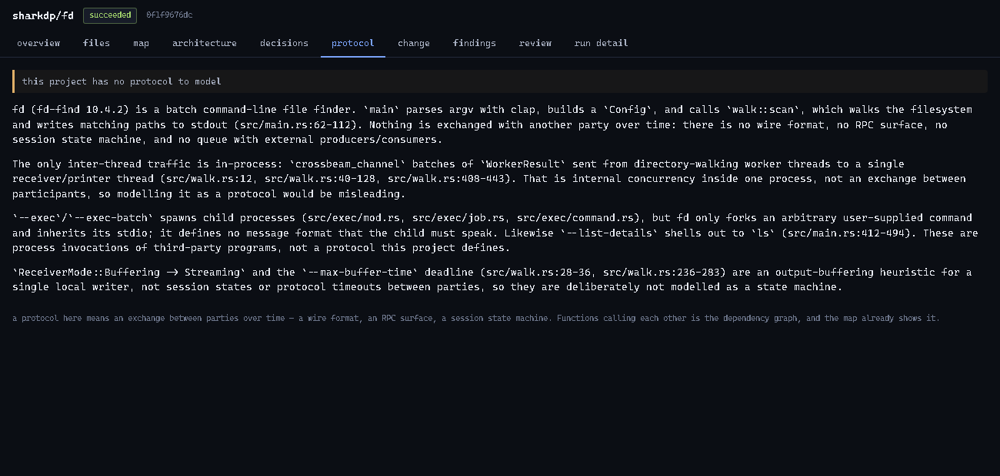

### Every run accounts for itself

The run detail page opens the manifest — toolchain versions, which model answered at what
token cost, the run's own degradation notes ("verification tools unavailable: …"), every
output by role, each row openable. Below it: the agent invocation ledger and a receipt for
every deterministic tool invocation. This is the page you open when you want to know
whether to believe the other pages.

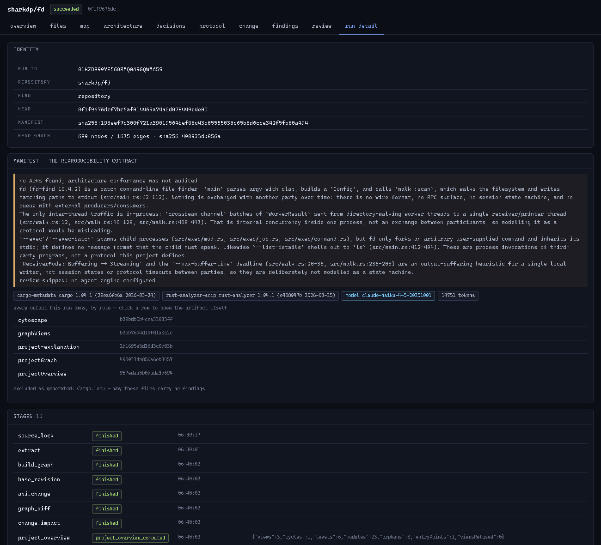

### Nothing leaves the machine without a human

The pipeline runs in **shadow mode**: it prepares the exact review payload and posts
nothing. Publishing requires, simultaneously: an explicit `request-approval`, a human
`approve` recorded with name and time, `CODEATLAS_PUBLISH_ENABLED=1` in the environment
(default off), an unset `CODEATLAS_KILL_SWITCH`, a clean secret scan, and no prior
publication — every one re-checked at post time, because reaching a code path is not
evidence of permission. The review tab reads the publication ledger rather than asserting
an outcome.

---

## From scratch

### Prerequisites

| What | Why | Notes |
|---|---|---|
| Python 3.12 + [uv](https://docs.astral.sh/uv/) | the backend | `uv sync` installs everything |
| Node 20+ | the dashboard | `npm install` in `frontend/` |
| PostgreSQL 17 | the evidence store | `infra/` has init scripts; credentials live in the OS keyring |
| Rust toolchain + `rust-analyzer` | extraction | `rustup`, plus `rust-analyzer` on PATH |
| `cargo-public-api`, `cargo-semver-checks` | the API delta | PR runs degrade gracefully without them |
| Structurizr CLI, `mmdc` *(optional)* | diagram validation | absence is noted in the manifest, never silent |
| `claude` CLI, logged in *(optional)* | narration, review, ask | everything deterministic works without it |

`uv run poe verify-env` prints the full tool matrix — what is installed versus required.

### Set up

```powershell
uv sync                          # Python deps into .venv
uv run poe verify-env            # check the tool matrix
# initialize PostgreSQL (see docs/runbooks/setup.md), then:
uv run python -c "from codeatlas.db.migrate import upgrade_head; from codeatlas.db.session import migrator_engine; e=migrator_engine(); upgrade_head(e); e.dispose()"
npm --prefix frontend install
uv run poe check                 # ruff + mypy --strict + pytest: everything green?
```

### Analyze your first project

```powershell
# Local path or any URL git can clone. Deterministic half only — no agent, no cost.
uv run codeatlas run --repo https://github.com/sharkdp/fd --repository-id sharkdp/fd --workdir var

# Add the narrated explanation (agent quota; --review adds the reviewers too):
uv run codeatlas run --repo <path-or-url> --repository-id owner/name --narrate [--review] [--replay] [--max-tokens N]
```

### Open the dashboard

```powershell
uv run codeatlas serve --workdir var --port 8137 --ask     # --ask enables the question box
$env:CODEATLAS_API = "http://127.0.0.1:8137"
npm --prefix frontend run preview                          # then open http://localhost:4173
```

### Review a pull request (shadow mode — posts nothing)

```powershell
uv run codeatlas review-pr owner/repo 42        # analyzes base AND head, prepares the payload
uv run codeatlas status <run-id>
uv run codeatlas compare <run-id> <run-id>      # exits nonzero if two runs are not reproducible
```

### Publish, if you choose to

```powershell
uv run codeatlas request-approval <run-id>
uv run codeatlas show-approval <approval-id>    # read the exact payload; prints the --payload value
$env:CODEATLAS_PUBLISH_ENABLED = "1"            # default off — publication is an explicit act
uv run codeatlas approve <approval-id> --by "<you>" --payload <12-char-sha> [--note "..."] --publish
# or the two-step flow:
uv run codeatlas approve <approval-id> --by "<you>" --payload <12-char-sha>
uv run codeatlas publish <approval-id>
```

`--payload` is proof of reading: the value only exists in `show-approval` output or the
dashboard, so you cannot approve bytes you have not looked at. What posts is a real PR
review — inline comments anchored on lines the diff added (findings outside the diff fold
into the body with permalinks), every byte carrying the AI-provenance marker the gate
enforces, findings already posted by an earlier run deduplicated by that same marker. The
posting path itself is live-tested (`-m github_live`, see `docs/runbooks/github-access.md`).

`CODEATLAS_KILL_SWITCH=1` stops every agent invocation and every publication, everywhere,
immediately. Database overrides: `CODEATLAS_DB_URL` / `CODEATLAS_DB_HOST` /
`CODEATLAS_DB_PORT` (and `CODEATLAS_TEST_DB_URL` for the test database).

---

## Pipeline

```
source_lock -> extract -> build_graph -> base_revision -> api_change -> graph_diff
            -> change_impact -> project_overview -> architecture -> narrate
            -> export_cytoscape -> review -> finalize
```

(`api_change` runs before `graph_diff` on purpose: the diff's interface labels need to know
which symbols the public-API delta named, and "changed but not exported" is only
expressible once that delta exists. `project_overview`, `architecture` and `narrate` are
the deterministic half of the comprehension features — the overview, files, map,
architecture, decisions, protocol and flows tabs all come from them.)

`source_lock` pins the revisions under analysis and, in pull-request mode, resolves the base
and derives the changed-path and added-line sets from the mirror. `base_revision` analyzes
the revision the change is measured against; it is a no-op for a whole-repository run, and
reuses an already-analyzed base when the extractor toolchain that produced it still matches
(ADR-0013). Each graph is stored as a snapshot with an explicit `role` of `base` or `head` —
"the run's graph" is not a well-formed question once a run holds two.

`graph_diff` compares the two graphs: which symbols and which *relationships* the change
added, removed or moved. That is the signal a text diff cannot give — *storage now imports
api* appears in the diff of neither file. Comparison runs on identities with the package
version stripped out, because a symbol id embeds it and a release bump would otherwise read
as the whole crate being rewritten; the version change is reported as its own fact.

`api_change` answers "what did this crate expose before, and what does it expose now"
without a model: `cargo public-api` renders the public surface of each revision and the
difference is arithmetic, then `cargo-semver-checks` classifies the severity. A package that
could not be measured on both sides is listed in `skipped` with the reason, never reported as
unchanged — "no API change" and "nothing was measured" must not look alike.

`change_impact` walks the dependency edges backwards from the symbols the change modified or
removed. One hop by default and two at the most: static change-impact precision is around
38–50%, so an unbounded closure reaches nearly everything while being right about nearly
none of it. Results are ranked (public API, crate-crossing, internal, test-only), the surplus
past the report limit is counted rather than dropped, and the precision caveat is a field of
the artifact so nothing can render the list without it.

The `review` stage then explains the change before reviewing it, because a reviewer needs to
know what a change does before being told what might be wrong with it. The explanation is
the one artifact a model writes, and what makes it usable is not the model's care but the
validator behind it: each claim must cite something this run measured, and a claim whose
citations do not resolve is removed and listed in `droppedClaims`. A softened false claim is
still a false claim, and it keeps the authority of appearing in the report.

## Design principle

Normalized, schema-validated evidence artifacts are the interfaces between pipeline stages:
facts (extractor receipts) → agent inferences (candidate findings) → validated findings →
presentation artifacts. No stage may launder inference into fact — the JSON Schemas in
`schemas/` are the source of truth for every contract.

## Repository layout

| Path | Purpose |
|---|---|
| `schemas/` | Versioned JSON Schemas (Draft 2020-12) — canonical contracts |
| `src/codeatlas/` | Python backend (extractors, pipeline, validation, API, CLI) |
| `frontend/` | React read-only dashboard (Vite + TypeScript) |
| `.agents/skills/` | Trusted, pinned skill registry + skill definitions |
| `docs/adr/` | Architecture decision records (MADR) |
| `docs/runbooks/` | Setup, operations, rollback |
| `docs/screenshots/` | The images in this README |
| `fixtures/` | Deliberately-flawed and clean Rust fixture crates for evaluation |
| `tests/` | unit / integration / e2e / security / regression + cassettes + golden files |
| `scripts/` | `verify_env.py` tool-matrix probe, live-integration validators, dev helpers |
| `infra/` | Install/validate scripts, receipts, DB init |

## Test tiers

`uv run poe check` is the fast gate (ruff + mypy --strict + pytest); `uv run poe check-all`
is the release gate — both halves including the Playwright e2e suites. Markers gate what
needs external capability: `subproc` (git/cargo/rust-analyzer), `pg` (local PostgreSQL),
`agent_live` (logged-in claude CLI). The live Playwright suite additionally needs a served
run: `CODEATLAS_RUN=<id> npm run e2e`.

External integrations are also validated directly against the live service before anything
depends on them, since a fixture cannot prove that authentication, ref fetching or caching
work against the real thing:

```powershell
uv run python scripts/validate_github.py             # GitHub read paths and refusals
uv run python scripts/validate_two_revisions.py owner/repo N   # both revisions, live PR
uv run python scripts/check_real_project.py --repo <url>       # every analysis, real crate
```

The last one is the important one for anything graph-shaped: a levelization that collapses,
an impact set that reaches everything, or a view that is a hairball only show up at real
size. `scripts/show_overview.py` and `scripts/show_views.py` print the results for a human
to look at — and the standing rule here is that a green suite is not evidence the
presentation is right; serving a real project and *looking* is.
