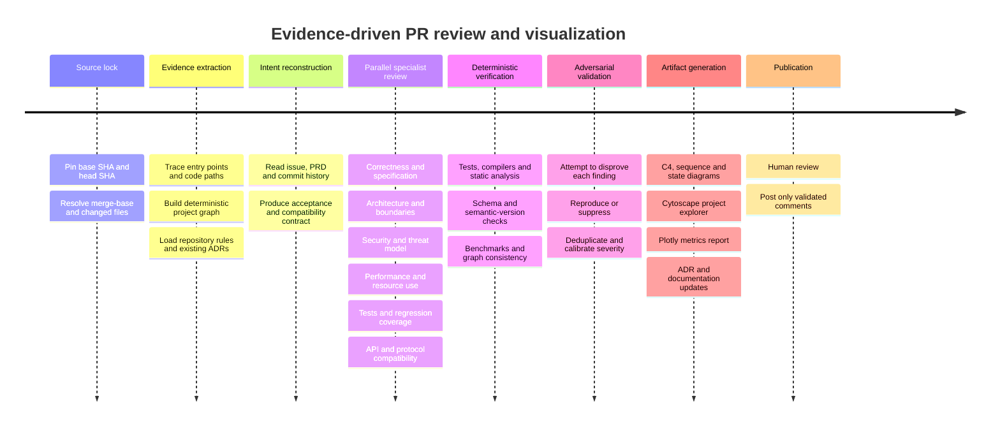
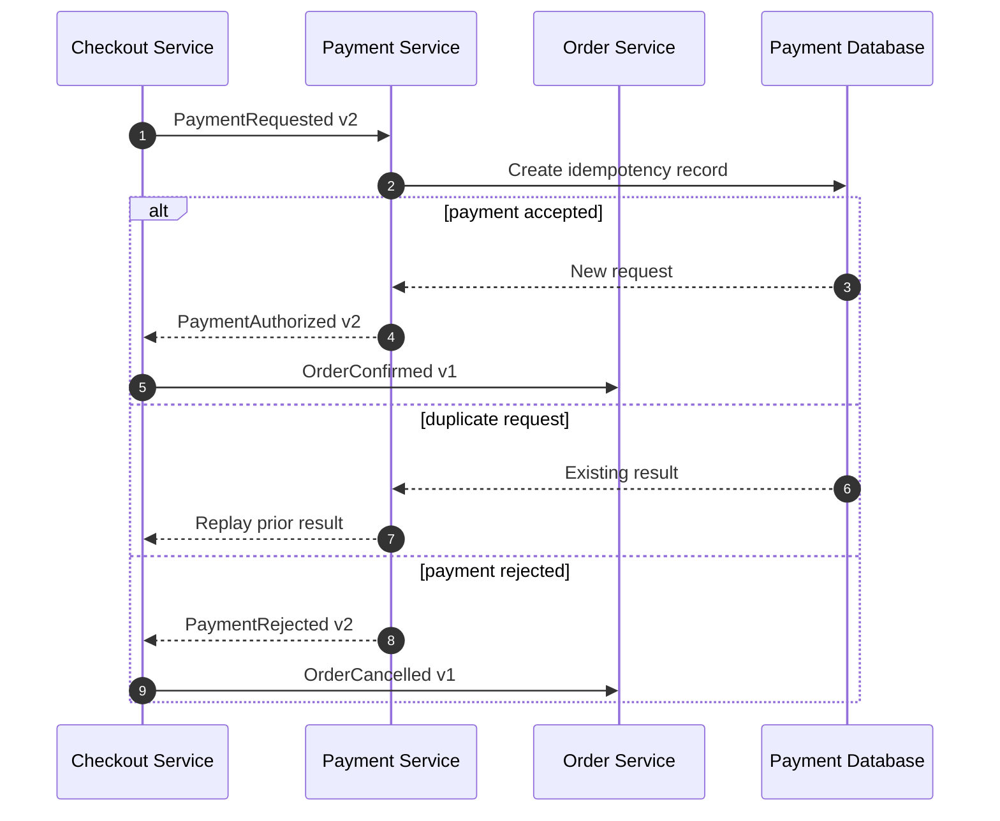

# Specialized Agent Skills for a PR-Review and Project-Visualization Pipeline

## Executive assessment

**Research snapshot:** August 5, 2026, with “mid-2026” interpreted as the skill ecosystem available around June–August 2026.

The strongest current design is **not one universal reviewer**. It is an evidence-driven pipeline in which deterministic tools establish facts, narrowly scoped agents analyze those facts independently, a validator attempts to disprove findings, and only then does an orchestrator publish a review.

The recommended architecture is:

1. **Pin the review scope** to exact base and head revisions.
2. **Extract repository evidence** with Microsoft Deep Wiki and language-native tooling.
3. **Reconstruct intent** from the issue, specification, commits, existing ADRs and project instructions.
4. **Run isolated specialists** for specification compliance, correctness, architecture, security, performance, tests and compatibility.
5. **Run deterministic checks** such as tests, static analysis, schema compatibility and graph extraction.
6. **Adversarially validate** every candidate finding.
7. **Generate documentation and visual artifacts** from the normalized evidence model.
8. **Keep PR posting disabled** until findings have passed confidence, reproducibility and deduplication gates.

The best official components are presently:

- **Microsoft Deep Wiki** for repository-grounded investigation and source-linked documentation.
- **Anthropic’s Code Review plugin** for GitHub-oriented multi-agent orchestration.
- **GitLab’s official `mr-review` skill** for GitLab merge requests.
- **OpenAI Codex Security’s `security-diff-scan`** for the most rigorous threat-model → discovery → validation → attack-path workflow.
- **OpenAI’s `security-threat-model`** for repository-grounded abuse-path analysis.
- **GitHub’s ADR skill** for standardized decision records.
- **Vercel’s optimization skills** when the project runs on Vercel.
- **NVIDIA’s skill-card and evaluation conventions** as a model for skill governance rather than as a PR reviewer itself. citeturn15search14turn20view2turn17search0turn16view3turn19view4turn16view6turn1search4turn1search1

The strongest community additions are:

- **Matt Pocock’s `code-review`** for independent Standards-versus-Spec review.
- **Matt Pocock’s `improve-codebase-architecture`** for architecture-focused HTML analysis.
- **Addy Osmani’s review, performance and testing skills** for reusable specialist rubrics.
- **Agents365’s `mermaid-skill`** for actual syntax validation, rendering and visual self-checking.
- **Alexander Opalic’s `walkthrough`** for interactive HTML explanations.
- **GStack’s `document-release`** for post-change documentation and architecture-diagram drift checks.
- **Alibaba Open Code Review** for a CLI-backed, provider-configurable review engine. citeturn19view0turn14search8turn19view1turn19view2turn19view3turn16view5turn19view5turn20view0turn20view4

Three important gaps remain. I did **not** find a dominant, mature official skill for a cross-language deterministic project graph, authoritative Structurizr maintenance, or ADR-to-implementation conformance auditing. Those should be implemented as small repository-local skills backed by compilers, language servers, schema tools and architecture-model validators rather than by free-form LLM inference.

### Priority conclusions

| Need | Best current choice | Confidence |
|---|---|---:|
| Repository evidence extraction | Microsoft Deep Wiki `wiki-researcher` | High |
| Intent/specification review | Matt Pocock `code-review` | High |
| GitHub review orchestration | Anthropic Code Review plugin | High |
| GitLab review orchestration | GitLab official `mr-review` | High |
| Security diff review | OpenAI Codex Security `security-diff-scan` | High |
| Repository threat model | OpenAI `security-threat-model` | High |
| General correctness synthesis | Addy Osmani `code-review-and-quality` | Medium-high |
| Performance review | Addy Osmani `performance-optimization`; Vercel Optimize for Vercel | Medium-high |
| Test/regression proof | Addy Osmani `test-driven-development` | Medium-high |
| Architecture review | Matt Pocock `improve-codebase-architecture` | Medium-high |
| Mermaid rendering | Agents365 `mermaid-skill` | High |
| C4 model maintenance | Custom Structurizr-backed skill | High recommendation; no dominant packaged skill |
| D2 rendering | Custom D2 wrapper or Claude Toolshed `d2` plugin | Medium |
| Interactive code walkthrough | Alexander Opalic `walkthrough` | Medium-high |
| Interactive dependency graph | Custom Cytoscape.js generator | High recommendation; not a packaged skill |
| Metrics and benchmark plots | Custom Plotly report skill | High recommendation; not a packaged skill |
| ADR creation | GitHub `create-architectural-decision-record` | High |
| ADR lifecycle | `skillrecordings/adr-skill` or project-local workflow | Medium |
| ADR implementation audit | Custom skill | High recommendation; no mature packaged option found |
| Documentation/release synchronization | GStack `document-release` | Medium-high |

## Prioritized catalog of specialized skills

Risk levels used below are analytical classifications:

- **Low:** instruction and local file generation, with no required network or arbitrary executable.
- **Medium:** invokes Git, tests, compilers, local renderers or other subprocesses.
- **High:** uses authenticated GitHub/GitLab access, external LLM APIs, remote renderers, production telemetry or comment-writing permissions.

“Render-and-validate” means the skill both invokes a real parser or renderer and checks the result. Merely generating Mermaid text does not qualify.

### Top skills by role

| Priority | Role | Repository and skill path | Compatibility | Best for and pipeline position | Evidence, rendering, risk and caveats |
|---:|---|---|---|---|---|
| **1** | Repository evidence extraction | [microsoft/skills](https://github.com/microsoft/skills), [`.github/plugins/deep-wiki/skills/wiki-researcher/SKILL.md`](https://github.com/microsoft/skills/blob/main/.github/plugins/deep-wiki/skills/wiki-researcher/SKILL.md) | Officially packaged as a GitHub Copilot plugin; manual use elsewhere is possible but not explicitly guaranteed | **First analysis stage.** Traces code paths, data flow, integrations and architecture; companion `wiki-page-writer` produces source-linked documentation and Mermaid diagrams | Requires paths, function names, call chains and import evidence; explicitly rejects “vibes-based diagrams.” **Risk: Medium** because it runs Git commands and writes artifacts. Mermaid output is produced, but an external render-validation loop is **unspecified**. Strongest general repository-research skill found. citeturn16view4turn15search34turn15search26 |
| **2** | Intent and specification reconstruction | [mattpocock/skills](https://github.com/mattpocock/skills), [`skills/engineering/code-review/SKILL.md`](https://github.com/mattpocock/skills/blob/main/skills/engineering/code-review/SKILL.md) | Agent Skills installer; repository says model-agnostic. Full behavior requires a host capable of parallel subagents | **After evidence extraction.** Runs independent Standards and Spec reviews and aggregates them side by side | Pins a fixed point, verifies the Git ref and diff, then resolves the originating issue/spec from commits, supplied paths or repository documents. **Risk: Medium** because of Git and optional issue-tracker access. No rendering. Excellent at detecting “clean implementation of the wrong requirement.” citeturn19view0turn14search9 |
| **3** | GitHub PR orchestration and independent scoring | [anthropics/claude-code](https://github.com/anthropics/claude-code), [`plugins/code-review`](https://github.com/anthropics/claude-code/tree/main/plugins/code-review) | Claude Code; GitHub only; requires authenticated `gh` | **Final GitHub orchestration stage.** Four parallel reviewers inspect repository instructions, bugs and history, followed by per-finding confidence scoring | Uses the PR diff, relevant `CLAUDE.md` files and Git history. Findings below the default confidence threshold of 80 are removed; terminal-only mode is the default and `--comment` publishes. **Risk: High** because it reads GitHub data and can write PR comments. No diagram rendering. Confidence scoring is valuable, but it is not equivalent to reproducing a bug. citeturn20view2turn20view3 |
| **4** | Security diff review and validation | [openai/plugins](https://github.com/openai/plugins), [`plugins/codex-security/skills/security-diff-scan/SKILL.md`](https://github.com/openai/plugins/blob/main/plugins/codex-security/skills/security-diff-scan/SKILL.md) | OpenAI Codex Security plugin; portability to unrelated hosts is unspecified | **Security specialist stage.** Runs repository-level threat modeling followed by diff-scoped discovery, validation and attack-path analysis | Uses deterministic diff-ranking inputs, per-candidate ledgers and completion receipts. Every candidate must be validated, suppressed, deferred or otherwise closed with an exact reason. **Risk: High** because it uses scripts, subagents and potentially external model/provider infrastructure. Hardening diagrams may be generated, but the workflow explicitly treats diagrams as explanatory rather than proof. Strongest audit trail among reviewed skills. citeturn16view3turn5search2turn5search4 |
| **5** | Repository threat modeling | [openai/skills](https://github.com/openai/skills), [`skills/.curated/security-threat-model/SKILL.md`](https://github.com/openai/skills/blob/main/skills/.curated/security-threat-model/SKILL.md) | OpenAI Codex/Agent Skills; other hosts supporting the format may load it, but official cross-host testing is unspecified | **Before security diff analysis.** Builds components, trust boundaries, assets, attacker capabilities, abuse paths and mitigations | Requires evidence for components, flows and controls; separates runtime behavior from CI/build/test tooling and keeps assumptions explicit. **Risk: Low–Medium** for local repository reads and Markdown generation. No rendering backend or render validation specified. It deliberately does not auto-trigger for ordinary code review. citeturn19view4 |
| **6** | GitLab MR orchestration | [gitlab-org/ai/skills](https://gitlab.com/gitlab-org/ai/skills), [`skills/mr-review/SKILL.md`](https://gitlab.com/gitlab-org/ai/skills/-/blob/main/skills/mr-review/SKILL.md) | GitLab’s repository targets assistants such as Claude Code, OpenCode and pi; uses `glab` for MR interaction | **GitLab alternative to Anthropic’s GitHub orchestrator.** Reads MR diffs, analyzes changes and optionally posts structured review comments | Evidence comes from MR metadata and diffs. Posting uses positioned comments through `glab`, with fallback payload support. **Risk: High** because it requires GitLab credentials and can write comments. Rendering is not applicable. For safer exploration, GitLab also publishes `mr-guided-review`, whose hard rule is not to post anything. citeturn17search0turn17search1turn17search3 |
| **7** | Correctness and quality synthesis | [addyosmani/agent-skills](https://github.com/addyosmani/agent-skills), [`skills/code-review-and-quality/SKILL.md`](https://github.com/addyosmani/agent-skills/blob/main/skills/code-review-and-quality/SKILL.md) | Standard skill layout; intended for general coding agents. Isolated installation should be tested because parts of the repository use shared references | **Parallel correctness reviewer or final synthesis stage.** Covers correctness, readability, architecture, security and performance | Requests specification alignment, edge-case handling, error paths, test results, races and state consistency. **Risk: Medium** when allowed to execute tests or scanners. No renderer. Broad and practical, but it overlaps with dedicated security and performance agents; use it as a synthesizer rather than five specialists in one context. citeturn19view1turn11search19 |
| **8** | Performance specialist | [addyosmani/agent-skills](https://github.com/addyosmani/agent-skills), [`skills/performance-optimization/SKILL.md`](https://github.com/addyosmani/agent-skills/blob/main/skills/performance-optimization/SKILL.md) | Standard skill layout; commands depend on the project stack | **Parallel specialist stage, after a benchmark or profile is available.** Reviews front end, back end, queries and databases | Explicitly requires measurement before optimization and a second measurement afterward. **Risk: Medium**, or High when connected to production telemetry. No diagram renderer. General-purpose guidance is strongest for web/application workloads; systems projects should supply project-specific `perf`, sanitizer, benchmark or compiler instrumentation commands. citeturn19view2 |
| **9** | Test and regression proof | [addyosmani/agent-skills](https://github.com/addyosmani/agent-skills), [`skills/test-driven-development/SKILL.md`](https://github.com/addyosmani/agent-skills/blob/main/skills/test-driven-development/SKILL.md) | Standard skill layout; discovers repository-specific test commands | **Validation stage.** Converts suspected defects into failing tests, then verifies fixes with RED → GREEN → full-suite execution | Requires a failing test before a behavior change or bug fix and treats tests as proof rather than narrative confidence. **Risk: Medium** because it executes project code. No renderer. Some examples in the wider collection lean toward JavaScript/TypeScript, so add language-specific reference files for Rust, C/C++, Java or Python. citeturn19view3turn11search11 |
| **10** | Architecture specialist | [mattpocock/skills](https://github.com/mattpocock/skills), [`skills/engineering/improve-codebase-architecture/SKILL.md`](https://github.com/mattpocock/skills/blob/main/skills/engineering/improve-codebase-architecture/SKILL.md) | Agent Skills-compatible; model-agnostic according to repository documentation | **Architecture-review stage.** Searches for shallow modules and opportunities to create deeper, better-defined interfaces, then generates a visual HTML report | Consumes project vocabulary and existing ADRs so it does not casually re-litigate documented decisions. **Risk: Medium** because it analyzes the repository and writes HTML. It generates a visual report, but parser/render validation is **unspecified**. Community issues indicate it may over-expand into long questioning sessions, so use a strict report-only wrapper in CI. citeturn14search0turn14search8turn14search13 |
| **11** | Mermaid, sequence and state rendering | [Agents365-ai/mermaid-skill](https://github.com/Agents365-ai/mermaid-skill), [`skills/mermaid-skill`](https://github.com/Agents365-ai/mermaid-skill/tree/main/skills/mermaid-skill) | Claude Code, Cursor, Copilot, OpenClaw, Codex, Hermes and other Agent Skills hosts, according to the repository | **Artifact-generation stage.** Produces flowcharts, sequences, states, ERDs, Git graphs and C4-context-style Mermaid | **Render-and-validate: Yes.** Parses before export, renders through local `mmdc` or remote Kroki, then visually inspects PNG output and allows bounded repair iterations. **Risk: Medium** with local `mmdc`; **High** with Kroki because diagram contents leave the machine. This is the strongest packaged Mermaid validation loop found. citeturn16view5 |
| **12** | ADR creation | [github/awesome-copilot](https://github.com/github/awesome-copilot), [`skills/create-architectural-decision-record/SKILL.md`](https://github.com/github/awesome-copilot/blob/main/skills/create-architectural-decision-record/SKILL.md) | GitHub Copilot Agent Skills; portability to other standard hosts is plausible but not explicitly tested by the source | **Decision-record stage.** Creates a proposed ADR with context, decision, alternatives, rejection rationale, positive/negative consequences and lifecycle metadata | Requires decision title, context, decision, alternatives and stakeholders. **Risk: Low** because it primarily writes Markdown. No render validation and no implementation audit. It standardizes creation well but does not prove the code follows the ADR. citeturn16view6 |

### Additional specialists worth installing selectively

| Role | Concrete repository or backend | Assessment |
|---|---|---|
| CLI-backed general review | [alibaba/open-code-review](https://github.com/alibaba/open-code-review), [`skills/open-code-review/SKILL.md`](https://github.com/alibaba/open-code-review/blob/main/skills/open-code-review/SKILL.md) | Useful when you want structured line comments, custom path rules, preview mode and OpenAI- or Anthropic-compatible provider configuration. It invokes the `ocr` executable and sends code to the configured model endpoint, so installation and data-exposure risk are High. Validation checks command success, not semantic truth. citeturn20view4 |
| Approval-gated GitHub workflow | [SpillwaveSolutions/pr-reviewer-skill](https://github.com/SpillwaveSolutions/pr-reviewer-skill), root [`SKILL.md`](https://github.com/SpillwaveSolutions/pr-reviewer-skill/blob/main/SKILL.md) | Collects PR metadata, diffs, commits, comments and issues through `gh`; can maintain a review workspace and delays posting until an explicit send step. High network/exec risk, but safer than immediate posting. citeturn13view2 |
| C4 diagrams | [softaworks/agent-toolkit](https://github.com/softaworks/agent-toolkit), `skills/c4-architecture` | Good lightweight C4 vocabulary and Mermaid output. It is not an authoritative model and no render-validation loop is specified. Use for explanatory views, not as the source of architectural truth. citeturn1search3 |
| Design-document Mermaid | [SpillwaveSolutions/design-doc-mermaid](https://github.com/SpillwaveSolutions/design-doc-mermaid), root `SKILL.md` | Stronger design-document workflow than a syntax cheat sheet and supports architecture, sequence, deployment and ER views. The source describes syntax validation and utilities, but the exact required renderer and visual self-check behavior are partly unspecified. citeturn3search0 |
| D2 diagrams | [diegomarino/claude-toolshed](https://github.com/diegomarino/claude-toolshed), plugin `d2`; exact internal `SKILL.md` path was not exposed by the indexed landing page | Generates, validates and renders D2 diagrams through a Claude Code plugin and local D2 tooling. The repository’s release history shows continued D2 work, including composition, sequence and architecture support. Medium local-exec risk. Pin a release because exact file layout is not clearly documented in the indexed source. citeturn14search1turn15search5 |
| Interactive HTML walkthrough | [alexanderop/walkthrough](https://github.com/alexanderop/walkthrough); exact current `SKILL.md` path is **unspecified** in the indexed source | Produces self-contained HTML with clickable Mermaid nodes, source snippets, pan/zoom and syntax highlighting. It has trigger and negative-case evaluation prompts. Rendering correctness beyond Mermaid generation is unspecified. Medium local file/HTML risk. citeturn19view5 |
| ADR as executable specification | [skillrecordings/adr-skill](https://github.com/skillrecordings/adr-skill), root `SKILL.md` | Treats ADRs as specifications that an agent implements and a human approves. Useful for ADR lifecycle discipline, but it still needs a separate conformance checker and deterministic architecture evidence. citeturn14search2 |
| Documentation/release synchronization | [garrytan/gstack](https://github.com/garrytan/gstack), [`document-release/SKILL.md`](https://github.com/garrytan/gstack/blob/main/document-release/SKILL.md) | Reads project docs and the shipped diff, creates a Diátaxis-style coverage map, updates core documentation, and checks architecture diagram entities against renames, splits, removals and moves. High local-exec/write risk because it has Bash, Read, Write and Edit access. citeturn20view0 |
| Vercel production performance | [vercel-labs/agent-skills](https://github.com/vercel-labs/agent-skills), [`skills/vercel-optimize/SKILL.md`](https://github.com/vercel-labs/agent-skills/blob/main/skills/vercel-optimize/SKILL.md) | Better than a generic performance reviewer for deployed Vercel applications because it begins from platform metrics. High network/account-access risk and not applicable to most systems projects. citeturn1search4 |
| Skill governance | [NVIDIA/skills](https://github.com/NVIDIA/skills), `skill-card-generator`; catalog-governance paths vary | NVIDIA’s repository is more valuable here as an evaluation model: skill cards, evaluation data, benchmark reports, signatures and governance review. It is not a PR reviewer, but its artifact expectations should be copied into an internal skill registry. citeturn1search1turn1search13 |

## Ordered pipeline and specialist routing

The pipeline should maintain a strict distinction between **facts**, **agent inferences**, **validated findings** and **presentation artifacts**.

| Stage | Recommended implementation | Primary output | Gate before continuing |
|---|---|---|---|
| Source lock | Git plus GitHub/GitLab metadata | Repository URL, base SHA, head SHA, merge base, changed paths | Revisions resolve; diff is non-empty; generated/vendor files classified |
| Repository evidence | Microsoft `wiki-researcher` | Evidence inventory, entry points, call/data-flow traces, integrations | Every material claim has file/function/line evidence |
| Deterministic project graph | Custom `extract-project-graph` | Versioned normalized graph JSON | Schema valid; extractor receipts present; no LLM-only edges marked as deterministic |
| Intent reconstruction | Matt `code-review` Spec axis, linked issue/spec, existing ADRs, commit history | Intent contract and acceptance criteria | Requirement source identified or explicitly marked unavailable |
| Parallel review | Separate correctness, architecture, security, performance, test and compatibility agents | Candidate findings with evidence and proposed reproduction | Review contexts isolated; no specialist posts comments |
| Deterministic verification | Tests, linters, CodeQL/Semgrep, compilers, schema/ABI tools, benchmarks | Command receipts, outputs and reproductions | Each finding receives supporting or contradicting evidence |
| Adversarial validation | Custom `finding-validator`; OpenAI security validation for security findings | Accepted, rejected, duplicate or unresolved finding status | Every finding closed with a reason |
| Synthesis | Anthropic, GitLab or custom orchestrator | Concise PR review with severity/confidence | Only changed-code findings; stable line anchors; duplicates removed |
| Architecture and protocol artifacts | Mermaid, Structurizr, D2 | C4 views, sequences, states, deployment and data flows | Parser/renderer succeeds; diagrams trace back to graph evidence |
| Interactive report | Cytoscape.js, Plotly, Walkthrough or CodeSee | Navigable graph and metrics report | Broken links, missing nodes and invalid metric sources rejected |
| Decision and documentation sync | GitHub ADR, ADR audit, GStack document-release | ADR updates, architecture docs, changelog and drift report | No accepted ADR silently altered; documentation diff human-reviewed |
| Publication | GitHub/GitLab write adapter | Review comment or check result | Explicit policy allows posting; shadow-mode quality target passed |

The specialist stage should use **separate contexts**. A single agent asked to check correctness, security, performance, tests and architecture tends to share assumptions across categories and can produce correlated errors. Anthropic’s plugin already uses multiple independent agents, Matt Pocock’s skill separates Standards from Spec, and OpenAI’s security workflow separates discovery from validation and attack-path analysis. citeturn20view2turn19view0turn16view3



### Specialist routing

| Review dimension | Preferred skill or implementation | Required evidence | Main weakness |
|---|---|---|---|
| Specification compliance | Matt Pocock `code-review`, Spec axis | Issue/spec path, acceptance criteria, exact diff | Spec quality limits review quality |
| Repository standards | Matt Pocock `code-review`, Standards axis; Anthropic CLAUDE.md agents | Repository instructions linked to exact violation | Standards documents can contain subjective or stale rules |
| Correctness | Addy `code-review-and-quality` plus project-local correctness prompt | Concrete execution path, failed invariant, test or reproduction | General skill; language-specific semantics need deterministic tooling |
| Architecture | Matt `improve-codebase-architecture`, Deep Wiki evidence, custom Structurizr audit | Dependency edges, entry points, interfaces, ADRs and deployment manifests | Architecture quality is partly judgment-dependent |
| Security | OpenAI `security-threat-model` and `security-diff-scan` | Trust boundary, attacker capability, reachable abuse path, existing controls | Higher compute and setup cost |
| Performance | Addy `performance-optimization`; Vercel Optimize on Vercel | Baseline, profile, workload, before/after measurement | Source inspection alone cannot establish performance impact |
| Tests | Addy `test-driven-development` | Failing reproduction, passing fix and full-suite result | Generated tests can merely encode current implementation |
| API compatibility | Custom `api-compatibility-review` | Old/new schemas and deterministic checker output | No compelling general packaged skill found |
| Protocol compatibility | Custom `protocol-auditor` | Message schemas, state transitions, captures/tests and version rules | Runtime behavior may differ from schema declarations |
| Independent validation | Custom `finding-validator`; OpenAI security validation for security | Candidate ledger, surrounding code, commands and reproduction | Requires an agent/model or context not used for discovery |
| PR publication | Anthropic Code Review or GitLab `mr-review` | Validated findings, exact revision and line positions | Authenticated write access creates operational risk |

For GitHub, Anthropic’s orchestrator is the better ready-made final layer. For GitLab, use the official `mr-review` skill, with `mr-guided-review` or terminal-only operation during rollout. GitLab’s narrower MR-comment skill explicitly confirms before writes because `glab mr note create` publishes immediately and has no native draft mode. citeturn20view3turn17search0turn17search2turn17search3

## Deterministic project graph and compatibility layer

No reviewed skill should be allowed to invent dependency, call or protocol edges solely from file names. Microsoft Deep Wiki itself requires actual call-chain and import evidence and explicitly rejects unsupported boxes and arrows. The appropriate solution is a custom `extract-project-graph` skill that invokes language-native extractors and records the provenance of every node and edge. citeturn16view4

### Recommended extractors

| Ecosystem | Deterministic sources | Recommended graph content | Important limitations |
|---|---|---|---|
| Rust | `cargo metadata`, rust-analyzer references/call hierarchy, rustdoc JSON, CodeQL where applicable | Workspaces, crates, features, modules, symbols, references, public API and dependency edges | Macros, conditional compilation and dynamic dispatch require configuration-specific graphs; rustdoc JSON compatibility can change across compiler versions. citeturn9search32turn18search1 |
| C/C++ | `compile_commands.json`, clangd background index, Clang AST, CMake File API, CodeQL | Translation units, include graph, symbols, calls, inheritance, compile flags and data-flow findings | Function pointers, template instantiations, preprocessor branches and generated code complicate completeness. Clangd’s index depends on a valid compilation database. citeturn9search1turn9search9turn9search11 |
| TypeScript/JavaScript | TypeScript Compiler API and project configuration, optionally CodeQL | Modules, imports, exports, declarations, references, types and call candidates | Dynamic imports, runtime property access and untyped JavaScript reduce precision. Loading the complete TS project improves reference analysis. citeturn9search2turn9search14turn9search15 |
| Python | Standard-library `ast`, import resolution, package metadata and CodeQL | Modules, classes, functions, imports, decorators and static call candidates | Monkey-patching, reflection, dynamic imports and dependency injection are not fully resolvable statically. The Python AST itself can change between Python releases. citeturn18search3turn9search7 |
| Cross-language | Build manifests, deployment manifests, OpenAPI/AsyncAPI/protobuf schemas, CodeQL databases | Services, packages, endpoints, queues, stores, FFI boundaries and deployment relationships | Cross-language correlation needs stable IDs and explicit adapters; do not merge similarly named entities without evidence. citeturn9search15turn9search3 |

Every extractor invocation should emit a receipt containing:

```json
{
  "extractor": "clangd-index",
  "extractorVersion": "resolved-at-runtime",
  "revision": "40-character-git-sha",
  "configuration": {
    "compilationDatabase": "build/compile_commands.json"
  },
  "startedAt": "RFC-3339 timestamp",
  "completedAt": "RFC-3339 timestamp",
  "exitCode": 0,
  "stdoutSha256": "sha256:...",
  "stderrSha256": "sha256:..."
}
```

Versions should be captured at runtime rather than copied from this report.

### Normalized project graph schema

The following is a compact starting point for a repository-owned Draft 2020-12 JSON Schema:

```json
{
  "$schema": "https://json-schema.org/draft/2020-12/schema",
  "$id": "https://example.org/schemas/project-graph.schema.json",
  "title": "Normalized Project Graph",
  "type": "object",
  "additionalProperties": false,
  "required": ["schemaVersion", "repository", "revision", "nodes", "edges"],
  "properties": {
    "schemaVersion": {
      "type": "string",
      "const": "1.0.0"
    },
    "repository": {
      "type": "object",
      "additionalProperties": false,
      "required": ["id"],
      "properties": {
        "id": { "type": "string", "minLength": 1 },
        "url": { "type": "string", "format": "uri" }
      }
    },
    "revision": {
      "type": "object",
      "additionalProperties": false,
      "required": ["head"],
      "properties": {
        "base": {
          "type": "string",
          "pattern": "^[0-9a-f]{40}$"
        },
        "head": {
          "type": "string",
          "pattern": "^[0-9a-f]{40}$"
        }
      }
    },
    "nodes": {
      "type": "array",
      "items": { "$ref": "#/$defs/node" }
    },
    "edges": {
      "type": "array",
      "items": { "$ref": "#/$defs/edge" }
    }
  },
  "$defs": {
    "sourceLocation": {
      "type": "object",
      "additionalProperties": false,
      "required": ["path"],
      "properties": {
        "path": { "type": "string", "minLength": 1 },
        "startLine": { "type": "integer", "minimum": 1 },
        "endLine": { "type": "integer", "minimum": 1 },
        "symbol": { "type": "string" }
      }
    },
    "evidence": {
      "type": "object",
      "additionalProperties": false,
      "required": ["kind", "producer"],
      "properties": {
        "kind": {
          "enum": [
            "compiler",
            "language-server",
            "build-system",
            "schema",
            "static-analysis",
            "runtime-trace",
            "test",
            "manual",
            "llm-inference"
          ]
        },
        "producer": { "type": "string", "minLength": 1 },
        "producerVersion": { "type": "string" },
        "artifact": { "type": "string" },
        "confidence": {
          "type": "number",
          "minimum": 0,
          "maximum": 1
        }
      }
    },
    "node": {
      "type": "object",
      "additionalProperties": false,
      "required": ["id", "kind", "label", "evidence"],
      "properties": {
        "id": { "type": "string", "minLength": 1 },
        "kind": {
          "enum": [
            "repository",
            "package",
            "module",
            "file",
            "type",
            "function",
            "service",
            "endpoint",
            "database",
            "queue",
            "external-system",
            "deployment-unit"
          ]
        },
        "label": { "type": "string", "minLength": 1 },
        "language": { "type": "string" },
        "location": { "$ref": "#/$defs/sourceLocation" },
        "tags": {
          "type": "array",
          "items": { "type": "string" },
          "uniqueItems": true
        },
        "metrics": {
          "type": "object",
          "additionalProperties": {
            "type": ["number", "integer", "string", "boolean"]
          }
        },
        "evidence": {
          "type": "array",
          "minItems": 1,
          "items": { "$ref": "#/$defs/evidence" }
        }
      }
    },
    "edge": {
      "type": "object",
      "additionalProperties": false,
      "required": ["id", "source", "target", "kind", "evidence"],
      "properties": {
        "id": { "type": "string", "minLength": 1 },
        "source": { "type": "string", "minLength": 1 },
        "target": { "type": "string", "minLength": 1 },
        "kind": {
          "enum": [
            "contains",
            "imports",
            "depends-on",
            "calls",
            "implements",
            "extends",
            "reads",
            "writes",
            "publishes",
            "subscribes",
            "exposes",
            "deploys",
            "authenticates-with",
            "transfers-data-to"
          ]
        },
        "configuration": { "type": "string" },
        "evidence": {
          "type": "array",
          "minItems": 1,
          "items": { "$ref": "#/$defs/evidence" }
        }
      }
    }
  }
}
```

The graph validator should additionally enforce constraints not easily expressed in basic JSON Schema:

- all edge endpoints exist;
- node and edge IDs are unique;
- `startLine <= endLine`;
- deterministic edges have at least one non-LLM evidence item;
- revision SHAs match the analyzed checkout;
- paths exist at the analyzed revision;
- conflicting extractor results remain separate until reconciled;
- graphs are reproducible across two clean runs with the same toolchain.

### API and protocol compatibility

This layer should be deterministic first and agent-explained second.

| Contract type | Recommended checker | Agent responsibility |
|---|---|---|
| OpenAPI | [oasdiff](https://github.com/oasdiff/oasdiff) | Explain breaking and behaviorally significant changes, connect them to consumers and request author confirmation where policy permits intentional breaks. `oasdiff breaking` reports client-breaking changes and can emit machine-readable formats. citeturn18search2turn18search6 |
| Protobuf/gRPC | [Buf breaking-change detection](https://buf.build/docs/breaking/) | Map each schema violation to producers, consumers and migration requirements. `buf breaking` compares current schemas to a selected baseline. citeturn18search0turn18search36 |
| Rust public API | [cargo-semver-checks](https://github.com/obi1kenobi/cargo-semver-checks) | Classify public API differences against the intended semantic-version policy and locate affected downstream crates. citeturn18search1turn18search17 |
| C/C++ ABI | Project-selected ABI checker | The best checker varies by platform and binary format; no single backend is recommended here without project constraints. Mark unsupported ABI targets explicitly. |
| Message protocols | Schema compiler plus conformance tests and optional packet traces | Reconstruct state transitions, framing, timeouts, retries and error behavior; do not infer wire compatibility from sequence diagrams alone. |

A custom `api-protocol-compatibility` skill should fail closed when a modified contract has no baseline, no declared compatibility policy or no applicable checker.

## Visualization, protocol and decision artifacts

Visualization should consume the normalized graph and validated review artifacts. It should not independently reinterpret the entire repository unless it records all inferred relationships as lower-confidence evidence.

### Backend selection

| Output | Recommended skill/backend | Render-and-validate | Operational notes |
|---|---|---:|---|
| Markdown-native flow, sequence, state and ER diagrams | Agents365 `mermaid-skill` | **Yes** | Local `mmdc` is preferred for sensitive repositories; Kroki is convenient but sends diagram source to an external API. citeturn16view5 |
| Source-grounded wiki diagrams | Microsoft `wiki-page-writer` | **Unspecified** | Strong source citation discipline, but add Mermaid CLI validation in CI. citeturn15search34 |
| Model-first C4 architecture | Structurizr DSL plus custom `structurizr-maintainer` | **Yes**, through official CLI validation | Structurizr’s CLI validates JSON/DSL workspaces and can export views. This is better than maintaining unrelated Mermaid diagrams when architectural consistency matters. citeturn19view7turn7search4turn7search16 |
| Polished diagram-as-code | D2 CLI plus custom `d2-renderer`, or Claude Toolshed’s `d2` plugin | **Yes** with CLI validation/render | D2 is suitable for modular, presentation-quality diagrams. Use pinned local binaries in CI. citeturn19view8turn15search5 |
| Interactive code/dependency graph | Cytoscape.js plus custom HTML generator | Schema and browser validation must be custom | Cytoscape.js is a graph-analysis and visualization library, not an Agent Skill. It can run interactively or headlessly. citeturn7search2 |
| Interactive metrics and benchmark plots | Plotly plus custom report generator | Data-schema and HTML smoke tests must be custom | Plotly can generate interactive HTML reports; preserve the underlying CSV/JSON so charts are auditable. citeturn7search3turn7search11 |
| Ready-made codebase and PR maps | CodeSee | Vendor-managed | Produces interactive codebase maps and automatic Review Maps, but is a SaaS integration rather than a portable skill and requires repository access. Review data-governance requirements before installation. citeturn19view9turn8search8turn8search13 |
| Interactive explanatory walkthrough | Alexander Opalic `walkthrough` | Partly; formal render validation unspecified | Good for human onboarding and complex PR explanations; generated source links and diagram nodes need CI checks. citeturn19view5 |

### Protocol-modeling output contract

A project-local `protocol-modeler` should produce one machine-readable protocol model and derive visual views from it:

```json
{
  "protocol": {
    "id": "checkout-events",
    "version": "2",
    "transport": "Kafka",
    "framing": "JSON Schema",
    "participants": [
      "checkout-service",
      "payment-service",
      "order-service"
    ],
    "states": [
      "Created",
      "PaymentPending",
      "Paid",
      "Rejected",
      "Expired"
    ],
    "messages": [
      {
        "name": "PaymentRequested",
        "producer": "checkout-service",
        "consumer": "payment-service",
        "schema": "schemas/payment-requested-v2.json"
      }
    ],
    "timeouts": [
      {
        "state": "PaymentPending",
        "duration": "PT15M",
        "transition": "Expired"
      }
    ],
    "evidence": [
      {
        "path": "src/checkout/events.ts",
        "symbol": "publishPaymentRequested"
      }
    ]
  }
}
```

From this single model, generate:

1. a sequence diagram for normal and failure exchanges;
2. a state diagram for legal transitions;
3. a message-schema summary;
4. a compatibility report against the base revision;
5. a trust-boundary overlay for security review.

A rendered Mermaid sequence example:



The sequence diagram communicates expected behavior, but the compatibility checker, tests and runtime traces remain the evidence.

### Structurizr DSL example

A custom `structurizr-maintainer` should update an existing workspace rather than generating disconnected diagrams:

```text
workspace "Checkout Platform" "Architecture model derived from project graph" {

    model {
        customer = person "Customer"

        platform = softwareSystem "Checkout Platform" {
            checkout = container "Checkout Service" "Owns checkout state" "Rust"
            payment = container "Payment Service" "Authorizes payments" "Go"
            orders = container "Order Service" "Creates confirmed orders" "Java"
            eventBus = container "Event Bus" "Carries domain events" "Kafka"
            paymentDb = container "Payment Database" "Stores payment state" "PostgreSQL"

            checkout -> eventBus "Publishes PaymentRequested" "JSON/Kafka"
            eventBus -> payment "Delivers PaymentRequested"
            payment -> paymentDb "Reads and writes payment state" "SQL/TLS"
            payment -> eventBus "Publishes PaymentAuthorized or PaymentRejected"
            eventBus -> checkout "Delivers payment result"
            checkout -> orders "Confirms or cancels order" "gRPC/TLS"
        }

        customer -> platform.checkout "Submits checkout" "HTTPS"
    }

    views {
        systemContext platform "SystemContext" {
            include *
            autoLayout
        }

        container platform "Containers" {
            include *
            autoLayout
        }
    }
}
```

The CI command should validate this workspace with the Structurizr CLI before accepting the artifact. Structurizr’s official `validate` command applies the same workspace rules as its web API. citeturn19view7

### Cytoscape.js graph example

The custom visualization skill can map the normalized graph into Cytoscape elements without discarding provenance:

```json
{
  "elements": {
    "nodes": [
      {
        "data": {
          "id": "checkout",
          "label": "Checkout Service",
          "kind": "service",
          "language": "Rust",
          "path": "services/checkout",
          "riskScore": 0.71
        }
      },
      {
        "data": {
          "id": "payment",
          "label": "Payment Service",
          "kind": "service",
          "language": "Go",
          "path": "services/payment",
          "riskScore": 0.84
        }
      }
    ],
    "edges": [
      {
        "data": {
          "id": "checkout-payment-request",
          "source": "checkout",
          "target": "payment",
          "kind": "publishes",
          "protocol": "PaymentRequested v2",
          "evidenceProducer": "schema-and-source-extractor"
        }
      }
    ]
  }
}
```

Useful interactive filters include changed-in-PR, trust boundary, owning team, language, test coverage, churn, complexity, public API, security finding and edge-evidence type.

### ADR lifecycle and implementation audit

GitHub’s ADR skill is the best lightweight creation template, while `skillrecordings/adr-skill` is more explicitly oriented toward using ADRs as executable specifications. Neither establishes that the current implementation still conforms to accepted decisions. citeturn16view6turn14search2

A custom `adr-implementation-audit` should:

- parse the ADR index and lifecycle metadata;
- select only Accepted, Deprecated and Superseded records relevant to changed components;
- extract testable architectural assertions;
- map each assertion to project-graph nodes, deployment manifests, schemas or tests;
- classify it as **conformant**, **probable drift**, **unverifiable** or **intentionally superseded**;
- prohibit automatic ADR status changes;
- generate a proposed ADR only when the change represents a durable decision rather than an implementation detail.

Example assertion record:

```json
{
  "adr": "docs/adr/adr-0017-event-driven-payment-results.md",
  "status": "Accepted",
  "assertion": "Checkout must receive payment results through the event bus, not a synchronous payment-service call.",
  "affectedNodes": ["checkout", "payment", "event-bus"],
  "evidence": [
    {
      "kind": "project-graph-edge",
      "edge": "checkout-payment-direct-call",
      "revision": "HEAD"
    }
  ],
  "auditResult": "probable-drift",
  "confidence": 0.93,
  "requiresHumanDecision": true
}
```

## Skill validation, installation risk and CI gates

Agent skills are executable supply-chain dependencies, even when their visible entry point is a Markdown file. Skills can include scripts and reference files, invoke local tools, inherit credentials and issue network requests. OpenAI’s security SDK documentation specifically warns that subprocesses inherit environment variables unless they are deliberately restricted. Research published in 2026 also found that skill metadata and instructions can manipulate discovery and selection, while existing scanners may miss semantically malicious behavior. citeturn0search24turn12academia20turn12academia22

GitHub’s skill installation tooling can record provenance and a tree SHA, and `gh skill publish --dry-run` can validate a skill package before publication. Pinning the exact source revision is preferable to tracking a mutable default branch. citeturn5search1

### Required install review

| Check | Required treatment |
|---|---|
| Source provenance | Pin an immutable commit or signed release; store repository URL, commit SHA, license and review date |
| Skill contents | Read `SKILL.md`, all referenced files, scripts, hooks, manifests and installer code |
| Executables | Enumerate every permitted binary; reject generic unrestricted shell execution where narrower commands suffice |
| Network | List domains and endpoints; fail if an undeclared destination is contacted |
| Credentials | Provide an allowlist environment containing only the credentials needed for that stage |
| Repository access | Use a read-only checkout for evidence extraction and review; create a separate writable worktree for proposed fixes |
| Write operations | Separate “analyze,” “render,” “edit” and “publish” capabilities into different skills or jobs |
| Commenting | Default to terminal/artifact output; require an explicit publish token or protected CI environment |
| Remote rendering | Do not send private diagrams to Kroki or another service unless data policy explicitly permits it |
| SaaS visualization | Treat CodeSee installation as granting a third party repository access; assess retention and data residency |
| Generated HTML | Apply Content Security Policy where possible and avoid embedding untrusted repository text as executable HTML |
| Updates | Review diffs before updating a pinned skill; do not auto-update production review skills |

### CI checks before auto-commenting

| CI gate | Suggested implementation | Pass criterion |
|---|---|---|
| Package structure | `gh skill publish --dry-run` or equivalent schema checker | No missing files, broken references or invalid front matter |
| Static safety scan | Shell/Python/JavaScript linters plus a skill scanner | No undeclared network calls, credential reads, destructive commands or path traversal |
| Dependency lock | Locked package manager and checksum verification | Reproducible install from approved registries |
| Permission test | Run in a container with read-only repository and empty credentials | Analysis succeeds without requesting unnecessary permissions |
| Network-denial test | Run with egress blocked | Prompt-only/local modes still work; failures are explicit rather than silently changing behavior |
| Trigger precision | Positive, negative and ambiguous prompt fixtures | Correct activation rate meets project threshold |
| Repository fixture tests | Small repositories containing seeded bugs and non-bugs | Expected findings found; benign patterns not reported |
| Historical PR replay | Run against previously reviewed PRs without showing human comments to the agent | Measured precision, recall and duplicate rate reported |
| Finding reproducibility | Each blocking finding must include or generate a test/command | Reproduction succeeds, or finding remains non-blocking/unresolved |
| Changed-code scope | Compare finding blame and base revision | No blocking comments for pre-existing issues unless the PR removes a safeguard |
| Idempotency | Execute twice at the same revision | Same normalized findings; no duplicate comments or artifact churn |
| Graph determinism | Run each extractor twice in clean containers | Canonical graph hashes match, excluding declared timestamps |
| Schema checks | Validate project graph, protocol model and review JSON | All artifacts satisfy versioned schemas |
| Mermaid validation | Local `mmdc` parse and SVG/PNG export | Exit code zero and non-empty artifact |
| Mermaid visual regression | Screenshot comparison plus node/label assertions | No clipped labels, missing nodes or unexpected orientation change |
| Structurizr validation | `structurizr validate` | Workspace valid |
| D2 validation | Pinned D2 CLI validate/render command | Parser and renderer succeed |
| Cytoscape smoke test | Headless browser loads generated HTML and queries graph elements | Expected node/edge counts and source links present |
| Plotly smoke test | Load standalone HTML in headless browser | Traces render; embedded source-data hash matches input |
| ADR audit fixtures | Repositories with conformant, drifting and superseded ADRs | Correct classification without automatic lifecycle mutation |
| Publication dry run | Render exact GitHub/GitLab payload to an artifact | Payload has stable line anchors and no secrets |
| Shadow-mode evaluation | Run on live PRs without posting | Human acceptance precision reaches an organization-defined threshold |
| Rollback | Disable publication through one protected configuration switch | Verified during staging exercise |

Do not use a raw confidence score as the only publication gate. Anthropic’s confidence filtering is useful, but confidence can be correlated across agents that share the same model and repository summary. A stronger gate requires at least one of:

- a failing test or reproducible command;
- deterministic static-analysis output;
- an exact violated specification or repository rule;
- a concrete call path and invariant contradiction;
- a compatibility checker result;
- independent reviewer confirmation from a fresh context.

NVIDIA’s catalog practices—skill cards, evaluation datasets, benchmark reports, signatures and governance review—provide a useful model for an internal skill registry. Microsoft’s skills repository similarly includes acceptance-test and evaluation infrastructure. These governance artifacts are a more meaningful maturity signal than popularity alone. citeturn1search13turn15search10

### Publication policy

A safe rollout has three modes:

| Mode | Capabilities | Recommended duration |
|---|---|---|
| Audit | Read repository, run approved tools, write local artifacts | Initial installation and fixture testing |
| Shadow | Analyze real PRs, publish only to CI artifacts visible to maintainers | Until precision and operational behavior are measured |
| Assisted publish | Prepare exact comments; human presses approve/send | Default mature mode |
| Automatic publish | Post only high-confidence, reproducible findings from an allowlisted category | Reserve for teams with sustained evaluation evidence |

Style, naming, optional refactoring and speculative performance observations should not be automatically posted. Automatic publication should initially be limited to findings such as reproducible test failures, compiler errors, deterministic API breaks, known-vulnerability scanner findings with confirmed reachability, and explicit repository-rule violations.

## Recommended minimal installation and custom skills

The smallest credible implementation is **six installed skill families plus five repository-local skills**.

### Minimal installed set

| Order | Install | Purpose | Default permission |
|---:|---|---|---|
| **1** | Microsoft Deep Wiki `wiki-researcher` and `wiki-page-writer` | Repository evidence and source-linked explanations | Read repository; write analysis artifacts |
| **2** | Matt Pocock `code-review` | Independent Standards and Spec review | Read diff, instructions, issue/spec |
| **3** | Anthropic `plugins/code-review` **or** GitLab official `mr-review` | Platform-specific PR/MR orchestration | Terminal/artifact output only initially |
| **4** | OpenAI `security-threat-model` and Codex Security `security-diff-scan` | Security model, discovery and validation | Read repository; execute approved scan scripts |
| **5** | Addy Osmani `performance-optimization` and `test-driven-development` | Measurement-first performance analysis and test-based proof | Execute approved benchmark/test commands |
| **6** | Agents365 `mermaid-skill` | Validated sequence, state, flow and ER artifacts | Local `mmdc`; remote Kroki disabled by default |
| **7** | GitHub `create-architectural-decision-record` | Standard ADR proposals | Write only under `docs/adr/` |
| **8**, optional | GStack `document-release` | Documentation and release drift synchronization | Separate writable job with human-reviewed diff |

This deliberately omits duplicate general-purpose reviewer packs. Add Alibaba Open Code Review only when its provider flexibility, CLI output or custom path rules provide a concrete advantage over the selected orchestrator. Add CodeSee only when the SaaS repository-access trade-off is acceptable.

### Custom skills to build

#### `extract-project-graph`

**Purpose:** Invoke language-native extractors and merge their results into the normalized graph schema.

**Required resources:** language adapters, schema validator, canonicalizer and extractor receipt generator.

**Hard rule:** An edge labeled as compiler-, language-server- or schema-derived must never be created from model inference.

#### `intent-and-decision-reconstructor`

**Purpose:** Collect the issue, PR description, specification, commit messages, existing ADRs, domain glossary and repository instructions into one immutable intent package.

**Output:** `intent.json`, with requirement IDs, source citations, compatibility obligations, non-goals and unresolved questions.

**Hard rule:** Unstated inferred intent must be labeled as inference and cannot independently justify a blocking comment.

#### `api-protocol-compatibility`

**Purpose:** Route changed contracts to `oasdiff`, Buf, `cargo-semver-checks` or project-selected ABI/schema checkers; generate sequence and state views from the resulting protocol model.

**Output:** machine-readable compatibility results plus explanatory Markdown.

**Hard rule:** Unsupported contract types are reported as unverified, never assumed compatible.

#### `finding-validator`

**Purpose:** Receive candidate findings without the discovery agent’s free-form reasoning, inspect surrounding code and evidence, run reproductions, and classify each finding.

**Output contract:**

```json
{
  "findingId": "F-0042",
  "status": "validated",
  "severity": "high",
  "confidence": 0.96,
  "introducedByChange": true,
  "location": {
    "path": "src/auth/session.rs",
    "startLine": 118,
    "endLine": 132
  },
  "claim": "The failure path retains the session capability after authentication rejection.",
  "evidence": [
    {
      "kind": "test",
      "command": "cargo test rejected_auth_revokes_capability",
      "exitCode": 101,
      "artifact": "artifacts/F-0042/test-output.txt"
    },
    {
      "kind": "call-path",
      "artifact": "artifacts/F-0042/call-path.json"
    }
  ],
  "counterEvidenceChecked": [
    "Drop implementation",
    "caller cleanup",
    "error conversion",
    "existing regression tests"
  ],
  "publicationEligible": true
}
```

**Hard rule:** The validator may suppress a discovery finding but may not silently introduce unrelated new findings.

#### `architecture-and-adr-audit`

**Purpose:** Maintain a Structurizr workspace from project-graph evidence, compare deployment/source structure against C4 views and accepted ADRs, and produce drift findings.

**Backends:** Structurizr CLI, optional D2 and Mermaid exports.

**Hard rule:** Never automatically delete a manually modeled relationship or supersede an ADR. Produce a proposed patch and evidence report.

#### `interactive-project-report`

This can remain a resource inside `architecture-and-adr-audit` rather than a sixth top-level skill.

**Purpose:** Generate a static site containing:

- Cytoscape.js dependency and data-flow exploration;
- Plotly churn, coverage, benchmark and risk plots;
- validated Mermaid or exported Structurizr diagrams;
- source links pinned to the analyzed revision;
- filters for changed files, services, trust boundaries, findings and evidence types.

**Hard rule:** Every metric and graph element exposes its source artifact and extractor version.

### Final recommended layout

```text
.agents/
└── skills/
    ├── extract-project-graph/
    │   ├── SKILL.md
    │   ├── scripts/
    │   ├── schemas/
    │   └── references/
    ├── intent-and-decision-reconstructor/
    │   ├── SKILL.md
    │   └── schemas/
    ├── api-protocol-compatibility/
    │   ├── SKILL.md
    │   ├── adapters/
    │   └── schemas/
    ├── finding-validator/
    │   ├── SKILL.md
    │   ├── policies/
    │   └── schemas/
    └── architecture-and-adr-audit/
        ├── SKILL.md
        ├── structurizr/
        ├── d2/
        ├── web-report/
        └── schemas/

review-artifacts/
├── source-lock.json
├── repository-evidence/
├── project-graph/
├── intent/
├── specialist-findings/
├── validation/
├── compatibility/
├── architecture/
├── visual-report/
└── publication/
```

The decisive design choice is to make the **normalized evidence artifacts** the interfaces between skills. Deep Wiki, review agents, security analysis, diagrams and interactive reports should not each construct their own incompatible understanding of the repository. They should consume the same pinned revision, project graph, intent package and finding ledger.

For a GitHub repository, the highest-value starting combination is Microsoft Deep Wiki, Matt Pocock `code-review`, Anthropic Code Review, OpenAI’s two security skills, Agents365 Mermaid and the five small custom skills above. For GitLab, replace the Anthropic publication layer with GitLab’s official `mr-review` and keep comment creation disabled until the same validation gates pass. This provides substantially better auditability than a single large reviewer prompt while remaining small enough to inspect, pin and evaluate.